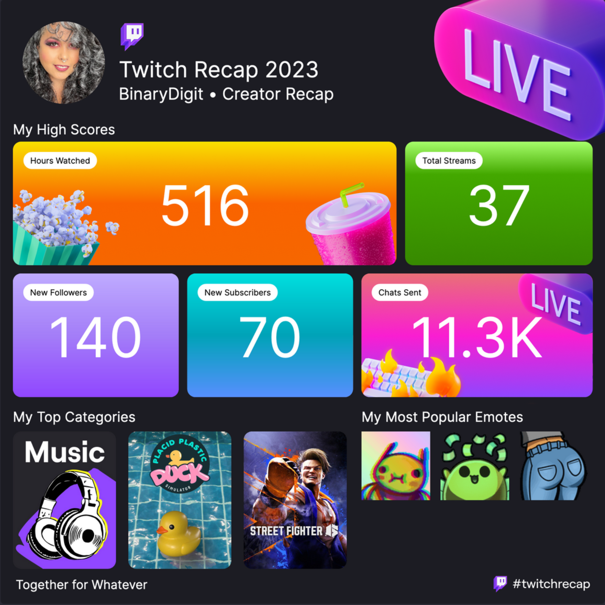
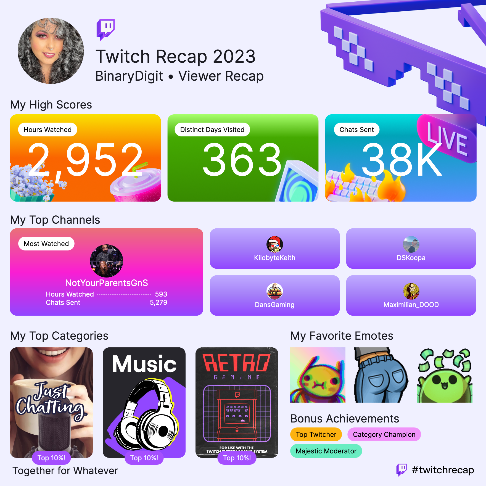

One thing I realize this year is that my streaming game hasn't been strong, which is fine at the moment, but I'd like to improve. I started doing DJ mixes on Twitch in March and was in my element, having so much fun and loving when chat comes in and hypes up the vibes with emotes and words of encouragement. I love entertaining folks and music is the universal language for us all! Music streams are a great break from doing gaming or chatting streams, which I also love, but find tough to do if my energy isn't in it. Granted streaming in general has been tough this year due to changes in my body and lack of energy, but I'm on a good road to getting back to my old self - my mind, my body, and getting back the energy I want for 2024. I'm in a lovely supportive space with room to grow and want to take advtange of that! 

How was your Twitch recap? Reply on your own site referencing this post or send me a message!